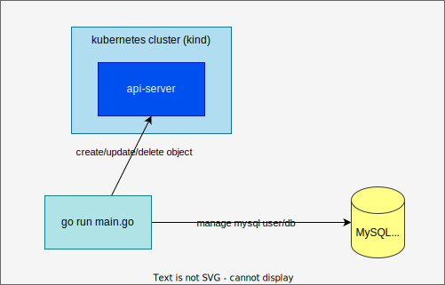
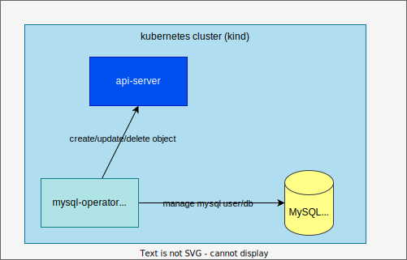
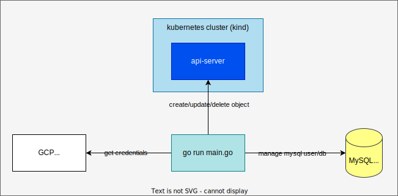
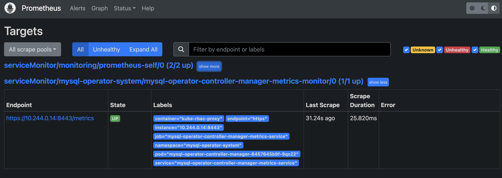
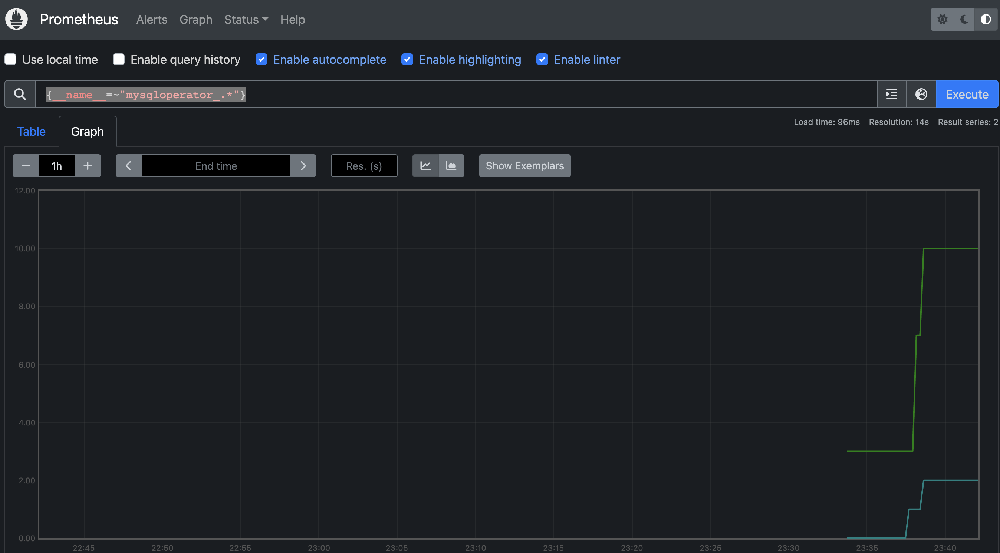

# 1. Code Style

[golangci-lint](https://golangci-lint.run)

Install:
```
brew install golangci-lint
```
Run lint:
```
golangci-lint run ./...
```

# 2. Run mysql-operator

## 2.1. Local



1. Run MySQL with Docker.
    ```
    docker run -d -p 3306:3306 -e MYSQL_ROOT_PASSWORD=password --rm mysql:8
    ```
1. Install CRD and run the operator locally.
    ```
    make install run
    ```
1. Apply sample resources.
    ```
    kubectl apply -k config/samples
    ```
1. Check Custom resources

    ```
    kubectl get -k config/samples
    NAME                                      HOST        ADMINUSER   CONNECTED   USERCOUNT   DBCOUNT   REASON
    mysql.mysql.nakamasato.com/mysql-sample   localhost   root        true        1           0         Ping succeded and updated MySQLClients

    NAME                                     PHASE   REASON
    mysqldb.mysql.nakamasato.com/sample-db   Ready   Database successfully created

    NAME                                        MYSQLUSER   SECRET   PHASE   REASON
    mysqluser.mysql.nakamasato.com/nakamasato   true        true     Ready   Both secret and mysql user are successfully created.
    ```

1. Confirm MySQL user is created in MySQL container.

    ```
    docker exec -it $(docker ps | grep mysql | head -1 |awk '{print $1}') mysql -uroot -ppassword -e "select User, Host, password_last_changed, password_expired, password_lifetime from mysql.user where User = 'nakamasato';"
    ```

1. `Secret` `mysql-mysql-sample-nakamasato` is created for the MySQL user.
    ```
    kubectl get secret mysql-mysql-sample-nakamasato -o jsonpath='{.data.password}'
    ```
1. Confirm you can connect to MySQL with the generated user.
    ```
    docker exec -it $(docker ps | grep mysql | head -1 |awk '{print $1}') mysql -unakamasato -p$(kubectl get secret mysql-mysql-sample-nakamasato -o jsonpath='{.data.password}' | base64 --decode)
    ```

1. Delete all the resources.
    ```
    kubectl delete -k config/samples
    ```

    <details>

    ```
    1.6780545572555468e+09  INFO    [FetchMySQL] Not found  {"controller": "mysql", "controllerGroup": "mysql.nakamasato.com", "controllerKind": "MySQL", "mySQL": {"name":"mysql-sample","namespace":"default"}, "namespace": "default", "name": "mysql-sample", "reconcileID": "0b6db5c6-8b3b-43ce-b903-a4959d55064e", "mysql.Name": "", "mysql.Namespace": ""}
    1.678054557255548e+09   INFO    [FetchMySQLUser] Found. {"controller": "mysqluser", "controllerGroup": "mysql.nakamasato.com", "controllerKind": "MySQLUser", "mySQLUser": {"name":"nakamasato","namespace":"default"}, "namespace": "default", "name": "nakamasato", "reconcileID": "78d4a7cf-5be0-4d47-82c0-38c7fdcf675b", "name": "nakamasato", "mysqlUser.Namespace": "default"}
    1.678054557255587e+09   ERROR   [FetchMySQL] Failed     {"controller": "mysqluser", "controllerGroup": "mysql.nakamasato.com", "controllerKind": "MySQLUser", "mySQLUser": {"name":"nakamasato","namespace":"default"}, "namespace": "default", "name": "nakamasato", "reconcileID": "78d4a7cf-5be0-4d47-82c0-38c7fdcf675b", "error": "MySQL.mysql.nakamasato.com \"mysql-sample\" not found"}
    sigs.k8s.io/controller-runtime/pkg/internal/controller.(*Controller).Reconcile
            /Users/m.naka/go/pkg/mod/sigs.k8s.io/controller-runtime@v0.12.3/pkg/internal/controller/controller.go:121
    sigs.k8s.io/controller-runtime/pkg/internal/controller.(*Controller).reconcileHandler
            /Users/m.naka/go/pkg/mod/sigs.k8s.io/controller-runtime@v0.12.3/pkg/internal/controller/controller.go:320
    sigs.k8s.io/controller-runtime/pkg/internal/controller.(*Controller).processNextWorkItem
            /Users/m.naka/go/pkg/mod/sigs.k8s.io/controller-runtime@v0.12.3/pkg/internal/controller/controller.go:273
    sigs.k8s.io/controller-runtime/pkg/internal/controller.(*Controller).Start.func2.2
            /Users/m.naka/go/pkg/mod/sigs.k8s.io/controller-runtime@v0.12.3/pkg/internal/controller/controller.go:234
    ```

    When getting stuck:

    ```
    kubectl patch mysqluser nakamasato -p '{"metadata":{"finalizers": []}}' --type=merge
    ```

    </details>

    1. Secret is deleted.
        ```
        kubectl get secret
        ```
    1. MySQL user is deleted.
        ```
        docker exec -it $(docker ps | grep mysql | head -1 |awk '{print $1}') mysql -uroot -ppassword
        ```

        <details><summary>details</summary>

        ```sql
        mysql> select User, Host from mysql.user;
        +---------------+-----------+
        | User          | Host      |
        +---------------+-----------+
        | root          | %         |
        | mysql.session | localhost |
        | mysql.sys     | localhost |
        | root          | localhost |
        +---------------+-----------+
        5 rows in set (0.00 sec)
        ```

        </details>

1. Clean up

```
make uninstall
docker rm -f $(docker ps | grep mysql | head -1 |awk '{print $1}')
```

## 2.2. Local kubernetes



1. Deploy controller with [skaffold](https://skaffold.dev/)

    ```bash
    skaffold dev
    ```

    You can check the operator installed in `mysql-operator-system` namespace.

    ```bash
    kubectl get po -n mysql-operator-system
    NAME                                                 READY   STATUS    RESTARTS   AGE
    mysql-operator-controller-manager-5bc69f545b-fcxst   2/2     Running   0          51s
    ```

1. Create Custom Resources (`MySQL` and `MySQLUser` resources).

    ```bash
    kubectl apply -k config/samples-on-k8s
    ```

1. Check Custom resources

    ```bash
    kubectl get -k config/samples-on-k8s
    ```

    ```
    NAME                                      HOST            ADMINUSER   CONNECTED   USERCOUNT   DBCOUNT   REASON
    mysql.mysql.nakamasato.com/mysql-sample   mysql.default   root        true        1           0         Ping succeded and updated MySQLClients

    NAME                                        MYSQLUSER   SECRET   PHASE   REASON
    mysqluser.mysql.nakamasato.com/nakamasato   true        true     Ready   Both secret and mysql user are successfully created.
    ```

1. Confirm MySQL user is created in MySQL container.

    ```bash
    kubectl exec -it $(kubectl get po | grep mysql | head -1 | awk '{print $1}') -- mysql -uroot -ppassword -e 'select User, Host from mysql.user where User = "nakamasato";'
    ```
    ```
    mysql: [Warning] Using a password on the command line interface can be insecure.
    +------------+------+
    | User       | Host |
    +------------+------+
    | nakamasato | %    |
    +------------+------+
    ```

1. `Secret` `mysql-mysql-sample-nakamasato` is created for the MySQL user.

    ```
    kubectl get secret mysql-mysql-sample-nakamasato -o jsonpath='{.data.password}'
    ```

1. Clean up the Custom Resources (`MySQL` and `MySQLUser` resources).

    ```bash
    kubectl delete -k config/samples-on-k8s
    ```

    <details><summary>If getting stuck in deletion</summary>

    ```
    kubectl exec -it $(kubectl get po | grep mysql | head -1 | awk '{print $1}') -- mysql -uroot -ppassword -e 'delete from mysql.user where User = "nakamasato";'
    kubectl patch mysqluser nakamasato -p '{"metadata":{"finalizers": []}}' --type=merge
    ```

    </details>

1. Stop the `skaffold dev` by `ctrl-c` -> will clean up the controller, CRDs, and installed resources.


## 2.3. Local with GCP Secret Manager



1. Setup gcloud
    ```bash
    PROJECT_ID=<project_id>
    gcloud auth login
    gcloud config set project $PROJECT_ID
    gcloud auth application-default login
    gcloud services enable secretmanager.googleapis.com # only first time
    ```
1. Create secret `mysql-password`
    ```
    echo -n "password" | gcloud secrets create mysql-password --data-file=-
    ```

    Check secrets:

    ```
    gcloud secrets list
    ```

1. Run MySQL with docker
    ```
    docker run -d -p 3306:3306 -e MYSQL_ROOT_PASSWORD=password --rm mysql:8
    ```
1. Install and run operator
    ```
    make install
    PRJECT_ID=$PROJECT_ID go run main.go --cloud-secret-manager gcp
    ```
1. Create custom resources
    ```
    kubectl apply -k config/samples-wtih-gcp-secretmanager
    ```
1. Check
    ```
    kubectl get -k config/samples-wtih-gcp-secretmanager
    NAME                                      HOST        ADMINUSER   CONNECTED   USERCOUNT   DBCOUNT   REASON
    mysql.mysql.nakamasato.com/mysql-sample   localhost   root        true        1           0         Ping succeded and updated MySQLClients

    NAME                                     PHASE   REASON
    mysqldb.mysql.nakamasato.com/sample-db   Ready   Database successfully created

    NAME                                        MYSQLUSER   SECRET   PHASE   REASON
    mysqluser.mysql.nakamasato.com/nakamasato   true        true     Ready   Both secret and mysql user are successfully created.
    ```
1. Clean up

    1. Remove CR:
        ```
        kubectl delete -k config/samples-wtih-gcp-secretmanager
        ```
    1. Stop controller `ctrl+c`
    1. Uninstall
        ```
        make uninstall
        ```
1. Clean up GCP
    ```
    gcloud secrets delete mysql-password
    gcloud auth revoke
    gcloud auth application-default revoke
    gcloud config unset project
    ```

# 3. Monitoring

1. Prepare Prometheus with Prometheus Operator
    1. Monitor with Prometheus
        ```
        kubectl create -f https://raw.githubusercontent.com/prometheus-operator/prometheus-operator/master/bundle.yaml
        ```
    1. Create `Prometheus`

        ```
        kubectl create ns monitoring
        kubectl apply -k https://github.com/nakamasato/kubernetes-training/contents/prometheus-operator
        ```
    1. port forward
        ```
        kubectl port-forward -n monitoring svc/prometheus-operated 9090:9090
        ```
1. Run mysql-operator with ServiceMonitor (a CRD of PrometheusOperator)
    1. Update `config/default/kustomization.yaml` to uncomment
        ```yaml
        - ../prometheus
        ```
    1. Run operator
        ```
        skaffold dev
        ```
1. Check Prometheus on http://localhost:9090/targets
    

    You can see the graph with custom metrics with `{__name__=~"mysqloperator_.*"}`
    
1. Clean up
    1. Remove CRD
        ```
        kubectl delete -f config/samples-on-k8s/mysql_v1alpha1_mysqluser.yaml
        kubectl delete -f config/samples-on-k8s/mysql_v1alpha1_mysql.yaml
        ```
    1. Stop skaffold dev
    1. Remove Proemetheus and Prometheus Operator
        ```
        kubectl delete -k https://github.com/nakamasato/kubernetes-training/contents/prometheus-operator
        kubectl delete -f https://raw.githubusercontent.com/prometheus-operator/prometheus-operator/master/bundle.yaml
        ```

# 4. Test

## 4.1. Versions

- Ginkgo: v1.16.4
- Gomega: v1.13.0

## 4.2. Controller Test

Run all

```
make test
```

Set `KUBEBUILDER_ASSETS`

```
export KUBEBUILDER_ASSETS="$(bin/setup-envtest use 1.26.0 -p path)"
```

Fail fast

```
bin/ginkgo -skip-package=e2e --fail-fast ./...
```

Run individual test

```
bin/ginkgo -skip-package=e2e --focus "Should have finalizer" --fail-fast ./...
```

## 4.3. e2e

### 4.3.1. e2e (kind + skaffold + ginkgo + gomega)

Prerequisite:
- [kind](https://kind.sigs.k8s.io/): local Kubernetes cluster
- [Skaffold](https://skaffold.dev/): workflow for building, pushing and deploying your application
- [ginkgo](https://onsi.github.io/ginkgo/)
- [gomega](https://onsi.github.io/gomega/)

Test steps:
1. BeforeSuite:
    1. Prepare `kind` cluster.
        1. Create `kind` cluster if not exist. Otherwise, recreate `kind` cluster if `lazymode` is false.
    1. Set up `k8sClient`.
    1. Delete `MySQLUser` and `MySQL` resources.
    1. Execute `skaffold run`.
        1. Deploy CRD and mysql-operator.
        1. Deploy MySQL with `Deployment`.
    1. Check `mysql-operator` is running.
1. Run test cases.
1. AfterSuite:
    1. Execute `skaffold delete`.
    1. Clean up `kind` cluster.

Run:

```
make e2e-with-ginkgo
```

<details><summary>If we want to debug with running each step with commands</summary>

1. Create a `kind` cluster:
    ```bash
    kind create cluster --name mysql-operator-e2e --kubeconfig e2e/kubeconfig --config e2e/kind-config.yml --wait 30s
    ```
1. Delete `MySQLUser` resources if exists.
    1. Delete the object:
        ```bash
        kubectl delete mysqluser john --kubeconfig e2e/kubeconfig
        ```
    1. Remove the finalizer if stuck:
        ```bash
        kubectl patch mysqluser john -p '{"metadata":{"finalizers": []}}' --type=merge --kubeconfig e2e/kubeconfig
        ```
1. Delete `MySQL` resources if exists.
    1. Delete the object:
        ```bash
        kubectl delete mysql mysql-sample --kubeconfig e2e/kubeconfig
        ```
    1. Remove the finalizer if stuck:
        ```
        kubectl patch mysql mysql-sample -p '{"metadata":{"finalizers": []}}' --type=merge --kubeconfig e2e/kubeconfig
        ```
1. Deploy `CRD`, `mysql-operator`, and MySQL with `Deployment`:
    ```
    cd e2e && skaffold run --kubeconfig kubeconfig --tail
    ```

</details>

### 4.3.2. e2e with kuttl

Prerequisite:

- [kind](https://kind.sigs.k8s.io/): local Kubernetes cluster
- [krew](https://krew.sigs.k8s.io/): kubectl plugin manager
    ```bash
    (
      set -x; cd "$(mktemp -d)" &&
      OS="$(uname | tr '[:upper:]' '[:lower:]')" &&
      ARCH="$(uname -m | sed -e 's/x86_64/amd64/' -e 's/\(arm\)\(64\)\?.*/\1\2/' -e 's/aarch64$/arm64/')" &&
      KREW="krew-${OS}_${ARCH}" &&
      curl -fsSLO "https://github.com/kubernetes-sigs/krew/releases/latest/download/${KREW}.tar.gz" &&
      tar zxvf "${KREW}.tar.gz" &&
      ./"${KREW}" install krew
    )
    ```
    Add `export PATH="${KREW_ROOT:-$HOME/.krew}/bin:$PATH"` to `~/.bashrc` or `~/.zshrc`
- [kuttl](https://kuttl.dev/): The KUbernetes Test TooL (kuttl)
    ```
    brew tap kudobuilder/tap
    brew install kuttl-cli
    ```

Test scenario:
1. MySQL `Deployment` and `Service`. -> Assert MySQL replica is 1.
1. Apply `config/samples-on-k8s`. -> `Secret` `mysql-mysql-sample-nakamasato` exists.

e2e steps:
1. Build a docker image `mysql-operator` with the latest codes.
1. Deploy controller (local image if you're running in local).
1. Deploy mysql `Deployment` and `Service`.
1. Create `MySQL` and `MySQLUser` by `kubectl apply -k ../../../config/samples-on-k8s`.
1. Check `Secret` `mysql-mysql-sample-nakamasato`.

Run:

```
make e2e-with-kuttl
```

<details>

```
docker build -t ghcr.io/nakamasato/mysql-operator:latest .
[+] Building 1.1s (17/17) FINISHED
 => [internal] load build definition from Dockerfile                                    0.0s
 => => transferring dockerfile: 37B                                                     0.0s
 => [internal] load .dockerignore                                                       0.0s
 => => transferring context: 35B                                                        0.0s
 => [internal] load metadata for gcr.io/distroless/static:nonroot                       0.9s
 => [internal] load metadata for docker.io/library/golang:1.16                          1.0s
 => [builder 1/9] FROM docker.io/library/golang:1.16@sha256:527d720ce3e2bc9b8900c9c165  0.0s
 => [internal] load build context                                                       0.0s
 => => transferring context: 643B                                                       0.0s
 => [stage-1 1/3] FROM gcr.io/distroless/static:nonroot@sha256:07869abb445859465749913  0.0s
 => CACHED [builder 2/9] WORKDIR /workspace                                             0.0s
 => CACHED [builder 3/9] COPY go.mod go.mod                                             0.0s
 => CACHED [builder 4/9] COPY go.sum go.sum                                             0.0s
 => CACHED [builder 5/9] RUN go mod download                                            0.0s
 => CACHED [builder 6/9] COPY main.go main.go                                           0.0s
 => CACHED [builder 7/9] COPY api/ api/                                                 0.0s
 => CACHED [builder 8/9] COPY controllers/ controllers/                                 0.0s
 => CACHED [builder 9/9] RUN CGO_ENABLED=0 GOOS=linux GOARCH=amd64 go build -a -o mana  0.0s
 => CACHED [stage-1 2/3] COPY --from=builder /workspace/manager .                       0.0s
 => exporting to image                                                                  0.0s
 => => exporting layers                                                                 0.0s
 => => writing image sha256:abcaffd48dc037de5e3cce48890e720c6bdcf86f229be598aaaeb76cf8  0.0s
 => => naming to ghcr.io/nakamasato/mysql-operator:latest                               0.0s

Use 'docker scan' to run Snyk tests against images to find vulnerabilities and learn how to fix them
/Applications/Xcode.app/Contents/Developer/usr/bin/make kuttl
kubectl kuttl test
=== RUN   kuttl
    harness.go:457: starting setup
    harness.go:245: running tests with KIND.
    harness.go:174: temp folder created /var/folders/5g/vmdg2t1j2011ggd9p983ns6h0000gn/T/kuttl484640091
    harness.go:203: node mount point /var/lib/docker/volumes/kind-0/_data
    harness.go:156: Starting KIND cluster
    kind.go:67: Adding Containers to KIND...
    kind.go:76: Add image mysql-operator:latest to node kind-control-plane
    harness.go:285: Successful connection to cluster at: https://127.0.0.1:57498
    logger.go:42: 22:09:26 |  | running command: [make install deploy IMG=mysql-operator VERSION=latest]
    logger.go:42: 22:09:26 |  | /Users/masato-naka/repos/nakamasato/mysql-operator/bin/controller-gen "crd:trivialVersions=true,preserveUnknownFields=false" rbac:roleName=manager-role webhook paths="./..." output:crd:artifacts:config=config/crd/bases
    logger.go:42: 22:09:28 |  | /Users/masato-naka/repos/nakamasato/mysql-operator/bin/kustomize build config/crd | kubectl apply -f -
    logger.go:42: 22:09:31 |  | customresourcedefinition.apiextensions.k8s.io/mysqls.mysql.nakamasato.com created
    logger.go:42: 22:09:31 |  | customresourcedefinition.apiextensions.k8s.io/mysqlusers.mysql.nakamasato.com created
    logger.go:42: 22:09:31 |  | cd config/manager && /Users/masato-naka/repos/nakamasato/mysql-operator/bin/kustomize edit set image controller=mysql-operator
    logger.go:42: 22:09:31 |  | /Users/masato-naka/repos/nakamasato/mysql-operator/bin/kustomize build config/default | kubectl apply -f -
    logger.go:42: 22:09:32 |  | namespace/mysql-operator-system created
    logger.go:42: 22:09:32 |  | customresourcedefinition.apiextensions.k8s.io/mysqls.mysql.nakamasato.com configured
    logger.go:42: 22:09:32 |  | customresourcedefinition.apiextensions.k8s.io/mysqlusers.mysql.nakamasato.com configured
    logger.go:42: 22:09:32 |  | serviceaccount/mysql-operator-controller-manager created
    logger.go:42: 22:09:32 |  | role.rbac.authorization.k8s.io/mysql-operator-leader-election-role created
    logger.go:42: 22:09:32 |  | clusterrole.rbac.authorization.k8s.io/mysql-operator-manager-role created
    logger.go:42: 22:09:32 |  | clusterrole.rbac.authorization.k8s.io/mysql-operator-metrics-reader created
    logger.go:42: 22:09:32 |  | clusterrole.rbac.authorization.k8s.io/mysql-operator-proxy-role created
    logger.go:42: 22:09:32 |  | rolebinding.rbac.authorization.k8s.io/mysql-operator-leader-election-rolebinding created
    logger.go:42: 22:09:32 |  | clusterrolebinding.rbac.authorization.k8s.io/mysql-operator-manager-rolebinding created
    logger.go:42: 22:09:32 |  | clusterrolebinding.rbac.authorization.k8s.io/mysql-operator-proxy-rolebinding created
    logger.go:42: 22:09:32 |  | configmap/mysql-operator-manager-config created
    logger.go:42: 22:09:32 |  | service/mysql-operator-controller-manager-metrics-service created
    logger.go:42: 22:09:32 |  | deployment.apps/mysql-operator-controller-manager created
    harness.go:353: running tests
    harness.go:74: going to run test suite with timeout of 120 seconds for each step
    harness.go:365: testsuite: tests/e2e/ has 1 tests
=== RUN   kuttl/harness
=== RUN   kuttl/harness/with-valid-mysql
=== PAUSE kuttl/harness/with-valid-mysql
=== CONT  kuttl/harness/with-valid-mysql
    logger.go:42: 22:09:32 | with-valid-mysql | Skipping creation of user-supplied namespace: default
    logger.go:42: 22:09:32 | with-valid-mysql/0-mysql-deployment | starting test step 0-mysql-deployment
    logger.go:42: 22:09:32 | with-valid-mysql/0-mysql-deployment | Deployment:default/mysql created
    logger.go:42: 22:09:32 | with-valid-mysql/0-mysql-deployment | Service:default/mysql created
    logger.go:42: 22:09:43 | with-valid-mysql/0-mysql-deployment | test step completed 0-mysql-deployment
    logger.go:42: 22:09:43 | with-valid-mysql/1-create-mysql-user | starting test step 1-create-mysql-user
    logger.go:42: 22:09:43 | with-valid-mysql/1-create-mysql-user | running command: [kubectl apply -k ../../../config/samples-on-k8s --namespace default]
    logger.go:42: 22:09:46 | with-valid-mysql/1-create-mysql-user | Warning: resource services/mysql is missing the kubectl.kubernetes.io/last-applied-configuration annotation which is required by kubectl apply. kubectl apply should only be used on resources created declaratively by either kubectl create --save-config or kubectl apply. The missing annotation will be patched automatically.
    logger.go:42: 22:09:46 | with-valid-mysql/1-create-mysql-user | service/mysql configured
    logger.go:42: 22:09:46 | with-valid-mysql/1-create-mysql-user | Warning: resource deployments/mysql is missing the kubectl.kubernetes.io/last-applied-configuration annotation which is required by kubectl apply. kubectl apply should only be used on resources created declaratively by either kubectl create --save-config or kubectl apply. The missing annotation will be patched automatically.
    logger.go:42: 22:09:46 | with-valid-mysql/1-create-mysql-user | deployment.apps/mysql configured
    logger.go:42: 22:09:46 | with-valid-mysql/1-create-mysql-user | mysql.mysql.nakamasato.com/mysql-sample created
    logger.go:42: 22:09:46 | with-valid-mysql/1-create-mysql-user | mysqluser.mysql.nakamasato.com/nakamasato created
    logger.go:42: 22:09:52 | with-valid-mysql/1-create-mysql-user | test step completed 1-create-mysql-user
    logger.go:42: 22:09:52 | with-valid-mysql | with-valid-mysql events from ns default:
    logger.go:42: 22:09:52 | with-valid-mysql | 2021-10-02 22:09:16 +0900 JST   Normal  Node kind-control-plane              Starting        Starting kubelet.
    logger.go:42: 22:09:52 | with-valid-mysql | 2021-10-02 22:09:16 +0900 JST   Normal  Node kind-control-plane              NodeHasSufficientMemory Node kind-control-plane status is now: NodeHasSufficientMemory
    logger.go:42: 22:09:52 | with-valid-mysql | 2021-10-02 22:09:16 +0900 JST   Normal  Node kind-control-plane              NodeHasNoDiskPressure   Node kind-control-plane status is now: NodeHasNoDiskPressure
    logger.go:42: 22:09:52 | with-valid-mysql | 2021-10-02 22:09:16 +0900 JST   Normal  Node kind-control-plane              NodeHasSufficientPID    Node kind-control-plane status is now: NodeHasSufficientPID
    logger.go:42: 22:09:52 | with-valid-mysql | 2021-10-02 22:09:16 +0900 JST   Normal  Node kind-control-plane              NodeAllocatableEnforced Updated Node Allocatable limit across pods
    logger.go:42: 22:09:52 | with-valid-mysql | 2021-10-02 22:09:26 +0900 JST   Normal  Node kind-control-plane              RegisteredNode  Node kind-control-plane event: Registered Node kind-control-plane in Controller
    logger.go:42: 22:09:52 | with-valid-mysql | 2021-10-02 22:09:27 +0900 JST   Normal  Node kind-control-plane              Starting        Starting kube-proxy.
    logger.go:42: 22:09:52 | with-valid-mysql | 2021-10-02 22:09:32 +0900 JST   Warning Pod mysql-5fd4b796b6-jhx52           FailedScheduling        0/1 nodes are available: 1 node(s) had taint {node.kubernetes.io/not-ready: }, that the pod didn't tolerate.
    logger.go:42: 22:09:52 | with-valid-mysql | 2021-10-02 22:09:32 +0900 JST   Normal  ReplicaSet.apps mysql-5fd4b796b6             SuccessfulCreate        Created pod: mysql-5fd4b796b6-jhx52
    logger.go:42: 22:09:52 | with-valid-mysql | 2021-10-02 22:09:32 +0900 JST   Normal  Deployment.apps mysql                ScalingReplicaSet       Scaled up replica set mysql-5fd4b796b6 to 1
    logger.go:42: 22:09:52 | with-valid-mysql | 2021-10-02 22:09:36 +0900 JST   Normal  Node kind-control-plane              NodeReady       Node kind-control-plane status is now: NodeReady
    logger.go:42: 22:09:52 | with-valid-mysql | 2021-10-02 22:09:41 +0900 JST   Normal  Pod mysql-5fd4b796b6-jhx52           Scheduled       Successfully assigned default/mysql-5fd4b796b6-jhx52 to kind-control-plane
    logger.go:42: 22:09:52 | with-valid-mysql | 2021-10-02 22:09:42 +0900 JST   Normal  Pod mysql-5fd4b796b6-jhx52.spec.containers{mysql}            Pulled  Container image "mysql:5.7" already present on machine
    logger.go:42: 22:09:52 | with-valid-mysql | 2021-10-02 22:09:42 +0900 JST   Normal  Pod mysql-5fd4b796b6-jhx52.spec.containers{mysql}            Created Created container mysql
    logger.go:42: 22:09:52 | with-valid-mysql | 2021-10-02 22:09:42 +0900 JST   Normal  Pod mysql-5fd4b796b6-jhx52.spec.containers{mysql}            Started Started container mysql
    logger.go:42: 22:09:52 | with-valid-mysql | Skipping deletion of user-supplied namespace: default
=== CONT  kuttl
    harness.go:399: run tests finished
    harness.go:508: cleaning up
    harness.go:517: collecting cluster logs to kind-logs-1633180192
    harness.go:563: removing temp folder: "/var/folders/5g/vmdg2t1j2011ggd9p983ns6h0000gn/T/kuttl484640091"
    harness.go:569: tearing down kind cluster
--- PASS: kuttl (295.94s)
    --- PASS: kuttl/harness (0.00s)
        --- PASS: kuttl/harness/with-valid-mysql (20.45s)
PASS
```

</details>

# 5. OLM (ToDo)

# 6. Tips
## 6.1. Error: `Operation cannot be fulfilled on mysqlusers.mysql.nakamasato.com \"john\": StorageError: invalid object, Code: 4, Key: /registry/mysql.nakamasato.com/mysqlusers/default/john, ResourceVersion: 0, AdditionalErrorMsg: Precondition failed: UID in precondition: cd9c94d1-992a-457d-8fab-489b21ed02e9, UID in object meta:`

```
[manager] 1.6781410047933352e+09        ERROR   Reconciler error        {"controller": "mysqluser", "controllerGroup": "mysql.nakamasato.com", "controllerKind": "MySQLUser", "mySQLUser": {"name":"john","namespace":"default"}, "namespace": "default", "name": "john", "reconcileID": "85fc0e64-f2b9-413f-af44-46ff1daad7f7", "error": "Operation cannot be fulfilled on mysqlusers.mysql.nakamasato.com \"john\": StorageError: invalid object, Code: 4, Key: /registry/mysql.nakamasato.com/mysqlusers/default/john, ResourceVersion: 0, AdditionalErrorMsg: Precondition failed: UID in precondition: cd9c94d1-992a-457d-8fab-489b21ed02e9, UID in object meta: "}
```

UID in precondition and UID in object meta are different?

https://github.com/kubernetes-sigs/controller-runtime/issues/2209

## 6.2. Slow build

```
time CGO_ENABLED=0 GOOS=linux GOARCH=amd64 go build -a -o manager main.go
CGO_ENABLED=0 GOOS=linux GOARCH=amd64 go build -a -o manager main.go  161.57s user 24.90s system 283% cpu 1:05.76 total
```

# 7. Reference
## 7.1. Finalizers
- https://book.kubebuilder.io/reference/using-finalizers.html
- https://zdyxry.github.io/2019/09/13/Kubernetes-%E5%AE%9E%E6%88%98-Operator-Finalizers/
- https://sdk.operatorframework.io/docs/building-operators/golang/advanced-topics/

## 7.2. Testing
- https://blog.bullgare.com/2021/02/mocking-for-unit-tests-and-e2e-tests-in-golang/
- https://int128.hatenablog.com/entry/2020/02/05/114940

## 7.3. Managing errors:
https://cloud.redhat.com/blog/kubernetes-operators-best-practices
1. Return the error in the status of the object. https://pkg.go.dev/github.com/shivanshs9/operator-utils@v1.0.1#section-readme
1. Generate an event describing the error.

## 7.4. MySQL
- http://go-database-sql.org/index.html
