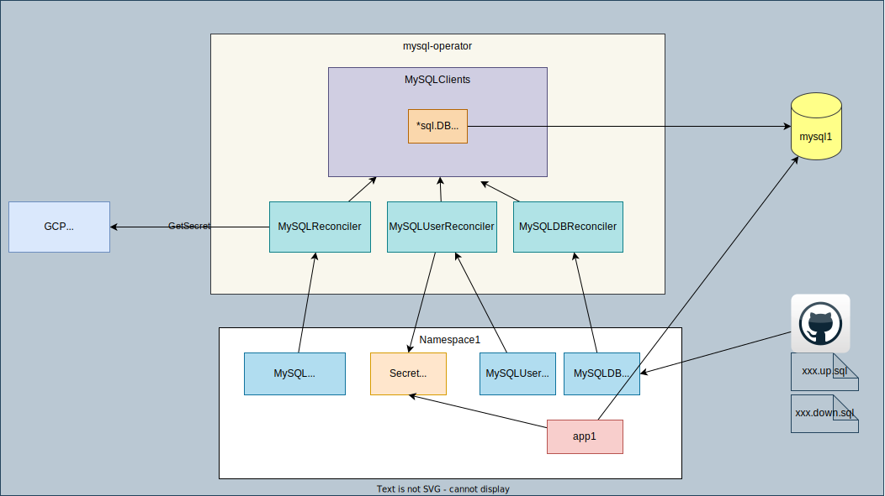

# MySQL Operator

[](https://codecov.io/gh/nakamasato/mysql-operator)

This is a go-based Kubernetes operator built with [operator-sdk](https://sdk.operatorframework.io/docs/building-operators/golang/), which manages MySQL databases, schema, users, permissions in existing MySQL servers. This operator DOES NOT manage MySQL cluster like other MySQL operators such as [vitess](https://github.com/vitessio/vitess), [mysql/mysql-operator](https://github.com/mysql/mysql-operator).

## Motivation

Reduce human operations:

1. **User management**: When creating a MySQL user for an application running on Kubernetes, it's necessary to create a MySQL user and create a Secret manually or with a script, which can be replaced with a Kubernetes operator. The initial idea is from KafkaUser and KafkaTopic in [Strimzi Kafka Operator](https://github.com/strimzi/strimzi-kafka-operator). With a custom resource for MySQL user, we can manage MySQL users with Kubernetes manifest files as a part of dependent application.
    Benefits from such a custom resource and operator:
    1. Kubernetes manifest files for an application and its dependent resources (including MySQL user) can be managed together with Kustomize or Helm chart, with which we can easily duplicate whole environment.
    1. There's no chance to require someone to check the raw password as it's stored directly to Secret by the operator, and read by the dependent application from the Secret.
1. **Database migration**: Reduce manual operations but keep changelog. When any schema migration or database operation is required, we needed a human operation, which has potential risk of human errors that should be avoided. With a Kubernetes operator, we can execute each database operation in the standard way with traceable changlog.

## Versions

- Go: 1.21

## Components



1. Custom Resource
    1. `MySQL`: MySQL cluster (`host`, `port`, `adminUser`, `adminPassword` hoding the credentials to connect to MySQL)
    1. `MySQLUser`: MySQL user (`mysqlName` and `host`)
    1. `MySQLDB`: MySQL database (`mysqlName`, `dbName`, `schemaMigrationFromGitHub`)
1. Reconciler
    1. `MySQLReconciler` is responsible for managing `MySQLClients` based on `MySQL` and `MySQLDB` resources
    1. `MySQLUserReconciler` is responsible for creating/deleting MySQL users defined in `MySQLUser` using `MySQLClients`, and creating Secret to store MySQL user's password
    1. `MySQLDBReconciler` is responsible for creating/deleting database and schema migration defined in `MySQLDB` using `MySQLClients`

## Getting Started

1. Install (Create CRD and operator objects)
    With kustomize:
    ```
    kubectl apply -k https://github.com/nakamasato/mysql-operator/config/install
    ```
    With Helm:
    ```
    helm repo add nakamasato https://nakamasato.github.io/helm-charts
    helm repo update
    helm install mysql-operator nakamasato/mysql-operator
    ```

1. (Optional) prepare MySQL.
    ```
    kubectl apply -k https://github.com/nakamasato/mysql-operator/config/mysql
    ```
1. Apply custom resources (`MySQL`, `MySQLUser`, `MySQLDB`).

    `mysql.yaml` credentials to connect to the MySQL:

    ```yaml
    apiVersion: mysql.nakamasato.com/v1alpha1
    kind: MySQL
    metadata:
      name: mysql-sample
    spec:
      host: mysql.default # need to include namespace if you use Kubernetes Service as an endpoint.
      adminUser:
        name: root
        type: raw
      adminPassword:
        name: password
        type: raw
    ```

    `mysqluser.yaml`: MySQL user

    ```yaml
    apiVersion: mysql.nakamasato.com/v1alpha1
    kind: MySQLUser
    metadata:
      name: sample-user
    spec:
      mysqlName: mysql-sample
      host: '%'
    ```

    `mysqldb.yaml`: MySQL database

    ```yaml
    apiVersion: mysql.nakamasato.com/v1alpha1
    kind: MySQLDB
    metadata:
      name: sample-db # this is not a name for MySQL database but just a Kubernetes object name
    spec:
      dbName: sample_db # this is MySQL database name
      mysqlName: mysql-sample
    ```

    ```
    kubectl apply -k https://github.com/nakamasato/mysql-operator/config/samples-on-k8s
    ```
1. Check `MySQLUser` and `Secret` for the MySQL user

    ```
    kubectl get mysqluser
    NAME         PHASE   REASON
    sample-user   Ready   Both secret and mysql user are successfully created.
    ```

    ```
    kubectl get secret
    NAME                            TYPE     DATA   AGE
    mysql-mysql-sample-sample-user   Opaque   1      10s
    ```
1. Connect to MySQL with the secret
    ```
    kubectl exec -it $(kubectl get po | grep mysql | head -1 | awk '{print $1}') -- mysql -usample-user -p$(kubectl get secret mysql-mysql-sample-nakamasato -o jsonpath='{.data.password}' | base64 --decode)
    ```
1. Delete custom resources (`MySQL`, `MySQLUser`, `MySQLDB`).
    Example:
    ```
    kubectl delete -k https://github.com/nakamasato/mysql-operator/config/samples-on-k8s
    ```

    <details><summary>NOTICE</summary>

    custom resources might get stuck if MySQL is deleted before (to be improved). → Remove finalizers to forcifully delete the stuck objects:
    ```
    kubectl patch mysqluser <resource_name> -p '{"metadata":{"finalizers": []}}' --type=merge
    ```
    ```
    kubectl patch mysql <resource_name> -p '{"metadata":{"finalizers": []}}' --type=merge
    ```

    ```
    kubectl patch mysqldb <resource_name> -p '{"metadata":{"finalizers": []}}' --type=merge
    ```

    </details>

1. (Optional) Delete MySQL
    ```
    kubectl delete -k https://github.com/nakamasato/mysql-operator/config/mysql
    ```
1. Uninstall `mysql-operator`
    ```
    kubectl delete -k https://github.com/nakamasato/mysql-operator/config/install
    ```

## With GCP Secret Manager

Instead of writing raw password in `MySQL.Spec.AdminPassword`, you can get the password for root user from an external secret manager (e.g. GCP) (ref: [Authenticate to Google Cloud using a service account](https://cloud.google.com/kubernetes-engine/docs/tutorials/authenticating-to-cloud-platform))

1. Create `SecretManager`
    ```
    echo -n "password" | gcloud secrets create mysql-password --data-file=-
    echo -n "root" | gcloud secrets create mysql-user --data-file=-
    ```
1. Create a `Secret` for credentials json for **service account** with `roles/secretm
anager.secretAccessor` permission
    ```
    kubectl create secret generic gcp-sa-private-key --from-file=sa-private-key.json
    ```
1. Install mysql-operator with `--set adminUserSecretType=gcp --set gcpProjectId=$PROJECT_ID`
    ```
    helm repo add nakamasato https://nakamasato.github.io/helm-charts
    helm repo update
    helm install mysql-operator nakamasato/mysql-operator --set adminUserSecretType=gcp --set gcpProjectId=$PROJECT_ID
    ```
1. You can specify `type: gcp` for `adminUser` and `adminPassword`.

    ```yaml
    apiVersion: mysql.nakamasato.com/v1alpha1
    kind: MySQL
    metadata:
      name: mysql-sample
    spec:
      host: mysql.default # need to include namespace if you use Kubernetes Service as an endpoint.
      adminUser:
        name: mysql-user # secret name in SecretManager
        type: gcp
      adminPassword:
        name: mysql-password # secret name in SecretManager
        type: gcp
    ```

    Example: (you need to run `kubectl apply -k config/mysql`)
    ```
    kubectl apply -k config/samples-on-k8s-with-gcp-secretmanager
    ```

[Read credentials from GCP SecretManager](docs/usage/gcp-secretmanager.md)

## Exposed Metrics

- `mysql_user_created_total`
- `mysql_user_deleted_total`
## Contributing

[CONTRIBUTING](CONTRIBUTING.md)
