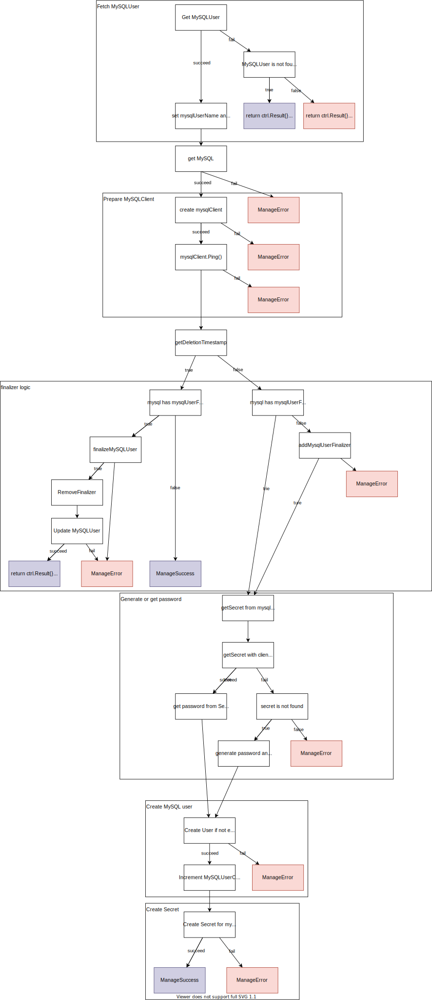

# Reconciliation Loop (Old)



## 1. Update subresource `status.conditions` (with operator-utils)

Use https://github.com/redhat-cop/operator-utils

Usage:

1. Update Reconciler with:
    ```go
    import "github.com/redhat-cop/operator-utils/pkg/util"

    ...
    type MyReconciler struct {
      util.ReconcilerBase
      Log logr.Logger
      ... other optional fields ...
    }
    ```

1. Update CRD:
    ```go
      // +patchMergeKey=type
      // +patchStrategy=merge
      // +listType=map
      // +listMapKey=type
      Conditions []metav1.Condition `json:"conditions,omitempty" patchStrategy:"merge"     patchMergeKey:"type"`
    }

    func (m *MyCRD) GetConditions() []metav1.Condition {
      return m.Status.Conditions
    }

    func (m *MyCRD) SetConditions(conditions []metav1.Condition) {
      m.Status.Conditions = conditions
    }
    ```

1. Replace `return ctrl.Result{}, err` with:

    ```go
    return r.ManageError(ctx, instance, err)
    ```

1. Replace `return ctrl.Result{}, nil` with:

    ```go
    return r.ManageSuccess(ctx, instance)
    ```
1. Object will have conditions:
    ```
    kubectl get mysqluser -o yaml
    ```
    ```yaml
    status:
      conditions:
      - lastTransitionTime: "2021-12-28T12:26:21Z"
        message: ""
        observedGeneration: 1
        reason: LastReconcileCycleSucceded
        status: "True"
        type: ReconcileSuccess
    ```

## 2. Update subresource `status`

1. Set mysqluser instance.

    ```go
    mysqlUser.Status.Phase = "NotReady"
    mysqlUser.Status.Reason = msg
    ```
1. Save the instance.

    ```
    err := r.Status.Update(ctx, mysqlUser)
    ```

> When updating the status subresource from the client, the StatusWriter must be used. The status subresource is retrieved with Status() and updated with Update() or patched with Patch().

https://sdk.operatorframework.io/docs/building-operators/golang/references/client/#updating-status-subresource

## 3. Display field in the result of `kubectl get` (`additionalPrinterColumns`)

If you don't want to `kubebuilder` marker, you can write CRD by yourself.

1. Add a column to Status.
    ```diff
     type MySQLStatus struct {
            // INSERT ADDITIONAL STATUS FIELD - define observed state of cluster
            // Important: Run "make" to regenerate code after modifying this file
    +
    +       //+kubebuilder:default=0
    +       UserCount int32 `json:"userCount"`
     }
    ```
1. Add kubebuilder marker.
    ```diff
     //+kubebuilder:object:root=true
     //+kubebuilder:subresource:status
    +//+kubebuilder:printcolumn:name="UserCount",type="integer",JSONPath=".status.userCount",description="The number of MySQLUsers that belongs to the MySQL"

     // MySQL is the Schema for the mysqls API
     type MySQL struct {
    ```
1. Run `make manifests`.

    ```diff
         singular: mysql
       scope: Namespaced
       versions:
    -  - name: v1alpha1
    +  - additionalPrinterColumns:
    +    - description: The number of MySQLUsers that belongs to the MySQL
    +      jsonPath: .status.userCount
    +      name: UserCount
    +      type: integer
    +    name: v1alpha1
         schema:
           openAPIV3Schema:
             description: MySQL is the Schema for the mysqls API
    @@ -52,6 +57,13 @@ spec:
                 type: object
               status:
                 description: MySQLStatus defines the observed state of MySQL
    +            properties:
    +              userCount:
    +                default: 0
    +                format: int32
    +                type: integer
    +            required:
    +            - userCount
                 type: object
             type: object
         served: true
    ```

1. `kubectl get`
    ```
    kubectl get mysql
    NAME           USERCOUNT
    mysql-sample
    ```

https://kubernetes.io/docs/tasks/extend-kubernetes/custom-resources/custom-resource-definitions/#additional-printer-columns
## 4. Add `OwnerReference` or `SetControllerReference` between CustomResources

1. Add `SetControllerReference` for MySQL
    ```go
    controllerutil.SetControllerReference(mysql, mysqlUser, r.Scheme)
    err := r.GetClient().Update(ctx, mysqlUser)
    if err != nil {
        return r.ManageError(ctx, mysqlUser, err) // requeue
    }
    ```

1. Get in yaml format.

    ```yaml
    kubectl get mysqluser nakamasato -o yaml
    ...
    metadata:
      ...
      ownerReferences:
      - apiVersion: mysql.nakamasato.com/v1alpha1
        blockOwnerDeletion: true
        controller: true
        kind: MySQL
        name: mysql-sample
        uid: 0689bf66-86a3-40a5-8e50-5e91533a8dc8
      resourceVersion: "928"
      uid: 09c69b78-79c5-4af8-9f84-7eb5dba52371
    ...
    ```

- [SetControllerReference](https://pkg.go.dev/sigs.k8s.io/controller-runtime/pkg/controller/controllerutil#SetControllerReference): Use this when you want to reconcile the owner object on changes to controlled one.
    > SetControllerReference sets owner as a Controller OwnerReference on controlled. This is used for garbage collection of the controlled object and for reconciling the owner object on changes to controlled (with a Watch + EnqueueRequestForOwner).

    Usually use with the following line in `SetupWithManager`:
    ```go
	Owns(&mysqlv1alpha1.MySQLUser{}).
    ```
- [SetOwnerReference](https://pkg.go.dev/sigs.k8s.io/controller-runtime/pkg/controller/controllerutil#SetOwnerReference): Use this when you just want garbage collection.
    > SetOwnerReference is a helper method to make sure the given object contains an object reference to the object provided. This allows you to declare that owner has a dependency on the object without specifying it as a controller.

## 5. Finalizer (Handle Cleanup on Deletion of external resource)

**Finalizer** is set to wait until dependents are deleted before deleting the object.

1. When a new object is created, add the finalizer.
1. When an object is deleted, `DeletionTimestamp` will be set.
1. Execute the finalizer logic if the finalizer exists.
1. Remove the finalizer.
> Once the list of finalizers is empty, meaning all finalizers have been executed, the resource is deleted by Kubernetes.

- https://kubernetes.io/blog/2021/05/14/using-finalizers-to-control-deletion/
- https://kubernetes.io/docs/tasks/extend-kubernetes/custom-resources/custom-resource-definitions/#advanced-topics
- https://book.kubebuilder.io/reference/using-finalizers.html
- https://sdk.operatorframework.io/docs/building-operators/golang/advanced-topics/#handle-cleanup-on-deletion
